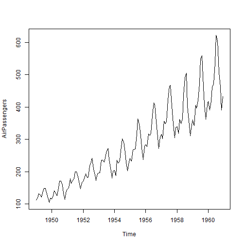

Modelling the AirPassengers Time Series
========================================================
author: Stephan Bartelheim   
date: 13.04.2018
autosize: true

The Air Passengers Data
========================================================


```r
data(AirPassengers)
str(AirPassengers)
```

```
 Time-Series [1:144] from 1949 to 1961: 112 118 132 129 121 135 148 148 136 119 ...
```
The AirPassengers dataset contains monthly total numbers of international airline passengers from 1949 to 1960.
***


The Time Series decomposed
========================================================


 ***
We can see that the series can be decomposed into a trend component a seasonal component and a noise. The noise doesn't look random and instead shows some autocorrelation.


 ARIMA Model
========================================================

```
Series: AirPassengers 
ARIMA(2,1,1)(0,1,0)[12] 

Coefficients:
         ar1     ar2      ma1
      0.5960  0.2143  -0.9819
s.e.  0.0888  0.0880   0.0292

sigma^2 estimated as 132.3:  log likelihood=-504.92
AIC=1017.85   AICc=1018.17   BIC=1029.35
```
***
Estimating an ARIMA model shows that there is indeed a AR, an I and a MA component which confirms our visual impression.


Forecast till 2020
========================================================


***
Using the model to forecast passenger numbers until 2020 is possible but yields extremely wide prediction intervals since we are predicting 60 years into the future. The prediction for 2016 is about 2 million, that's 25 million per year, whereas the real number according to IATA was close to 4 billion.
